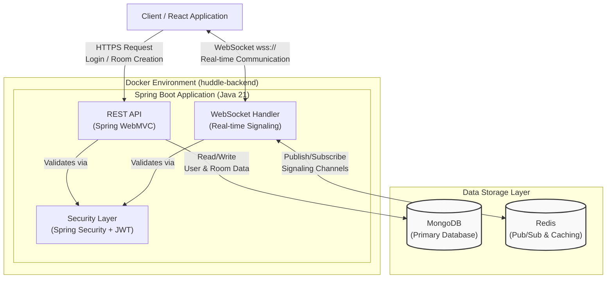

# Huddle

Huddle is a secure, peer-to-peer video conferencing application built with privacy as its core principle. It leverages WebRTC mesh networking to create direct connections between participants, ensuring that your audio, video, and chat data are never routed through or stored on a central server.

## Features

* **Peer-to-Peer Communication:** Utilizes WebRTC mesh topology for direct, encrypted video, audio, and data channels between all participants.
* **Serverless Media Streams:** The backend server only acts as a signaling intermediary to initiate connections; it never has access to your media streams.
* **Secure Authentication:** Supports both traditional username/password registration and ephemeral, auto-expiring guest accounts for quick access.
* **Real-time Chat:** An integrated chat panel allows for peer-to-peer text messaging during calls.
* **Modern & Responsive UI:** Built with React, TypeScript, and Tailwind CSS for a clean and intuitive user experience.
* **Scalable Signaling:** Employs Redis for state management and pub/sub messaging, allowing the signaling backend to be scaled horizontally.

## Technology Stack

This is a monorepo containing the frontend and backend applications.

* **Backend (Spring Boot)**
    * **Framework:** Spring Boot (Java 21)
    * **Authentication:** Spring Security with JWT
    * **Real-time Signaling:** Spring WebSocket
    * **Database:** MongoDB for user persistence
    * **State & Messaging:** Redis for session management, room state, and multi-instance signaling
    * **Containerization:** Docker & Docker Compose

* **Frontend (React)**
    * **Framework:** React (with Vite)
    * **Language:** TypeScript
    * **Styling:** Tailwind CSS
    * **Routing:** React Router
    * **API Communication:** Axios

## Architecture Overview

Huddle is designed to maximize privacy by minimizing the server's role. Below is the system architecture detailing how the client interacts with the backend services:



### Connection Flow
1.  **Authentication:** A user logs in or registers (as a standard or guest user) with the Spring Boot backend and receives a JSON Web Token (JWT).
2.  **Room Entry:** The user either creates a new room or joins an existing one via a REST API call. The backend validates the request.
3.  **Signaling Handshake:** The client establishes a WebSocket connection to the signaling server, authenticating using the JWT.
4.  **Peer Discovery:** Upon joining, the server provides the new client with a list of existing peers in the room.
5.  **WebRTC Connection:** The client initiates a direct WebRTC peer connection with every other client in the room. The server's role is limited to relaying the initial `offer`, `answer`, and `ICE candidate` messages required to establish these direct connections.
6.  **P2P Communication:** Once the connections are established, all media (video, audio) and chat messages flow directly between peers, encrypted and inaccessible to the server.

## Getting Started

To run Huddle locally, you will need Java 21, Node.js, Docker, and Docker Compose installed.

### Prerequisites

* Java (JDK 21+)
* Node.js (v20+) and npm
* Docker and Docker Compose *(Note: MongoDB and Redis are handled automatically via Docker Compose)*

### Backend Setup

1.  **Navigate to the backend directory:**
    ```bash
    cd backend/backend-springboot
    ```

2.  **Configure Environment Variables:**
    Create a `.env` file in the `backend/backend-springboot` directory and populate it with your configuration. Use the following template, ensuring your secrets are strong and unique.

    ```env
    # Server Configuration
    SERVER_PORT=8080

    # MongoDB Connection URI
    SPRING_DATA_MONGODB_URI=mongodb://localhost:27017/huddle

    # Redis Connection
    SPRING_DATA_REDIS_HOST=localhost
    SPRING_DATA_REDIS_PORT=6379

    # Application Secrets (IMPORTANT: Change these for production)
    ROOM_CODE_CHARSET=ABCDEFGHJKLMNPQRSTUVWXYZ23456789
    GUEST_USER_PASSWORD=your-super-secret-guest-password
    SIGNALING_SECRET_SALT=a-very-secret-salt-for-hashing-uids
    JWT_SECRET=a-long-and-secure-jwt-secret-key-that-is-at-least-256-bits-long
    
    # Application Settings
    GUEST_USER_EXPIRE_AFTER_SECONDS=86400 # 24 hours
    SIGNALING_SESSION_MAX_IDLE_TIME=30000 # 30 seconds
    SIGNALING_SESSION_PING_RATE=15000 # 15 seconds
    JWT_EXPIRATION=86400000 # 24 hours in ms
    REDIS_CHANNEL_NAME=huddle-room-
    ROOM_CODE_ATTEMPTS=10
    ROOM_EXPIRATION_TIME=1
    ROOM_EXPIRATION_TIME_UNIT=HOURS
    ```

3.  **Run the application using Docker Compose:**
    This command will build the Spring Boot application and spin up the necessary MongoDB and Redis containers.

    ```bash
    docker compose up --build
    ```
    The backend will be accessible at `http://localhost:8080`.

### Frontend Setup

1.  **Navigate to the frontend directory:**
    ```bash
    cd frontend
    ```

2.  **Install dependencies:**
    ```bash
    npm install
    ```

3.  **Run the development server:**
    ```bash
    npm run dev
    ```
    The frontend will be accessible at `http://localhost:5173` (or another port if 5173 is in use). The application is pre-configured to communicate with the backend running on port `8080`.

4.  **Open the application:**
    Open your browser and navigate to the URL provided by the Vite development server. You can now create an account, log in, or join as a guest to start a Huddle session.
